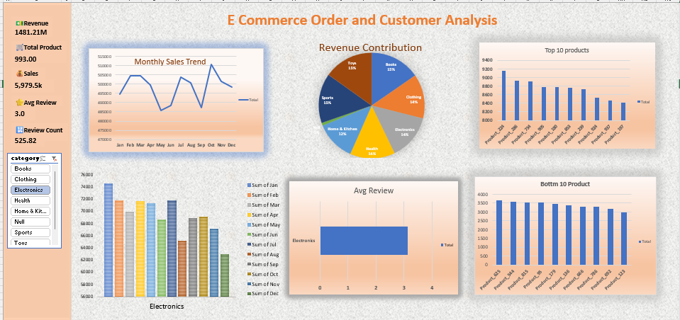

# 📊 E-commerce Product Sales Analytics Dashboard

An interactive **Microsoft Excel dashboard** designed to analyze e-commerce product sales performance and transform raw sales data into actionable business insights. The dashboard enables managers to monitor key business metrics, identify sales trends, evaluate product performance, and make informed business decisions.

---

## 📌 Project Overview

E-commerce businesses generate large volumes of sales data every day. Analyzing this data manually is time-consuming and makes it difficult to identify valuable insights.

This project addresses that challenge by creating an interactive Excel dashboard that provides a comprehensive overview of business performance through KPIs, charts, and slicers.

The dashboard helps answer important business questions such as:
- Which product categories generate the highest revenue?
- How do sales change throughout the year?
- Which products perform the best and worst?
- How satisfied are customers based on reviews?
- What business actions can improve sales performance?

---

## 🎯 Business Objectives

- Monitor overall business performance.
- Track monthly sales trends.
- Compare revenue contribution across product categories.
- Identify top-performing and low-performing products.
- Evaluate customer satisfaction using product reviews.
- Support data-driven decision-making.

---

## 📂 Dataset Information

The dataset contains the following information:

- Product ID
- Product Name
- Product Category
- Revenue
- Monthly Sales (January–December)
- Total Sales
- Customer Reviews

---

## 📈 Dashboard Features

### 🔹 KPI Cards
- Total Revenue
- Total Products
- Total Sales
- Average Review
- Total Review Count

### 🔹 Interactive Charts

- Product Category Revenue Contribution
- Monthly Sales Trend
- Top 10 Best-Selling Products
- Bottom 10 Products
- Average Review by Category

### 🔹 Interactive Slicer

- Product Category Filter

---

## 📊 Business Insights

Using this dashboard, businesses can:

- Analyze yearly sales performance.
- Understand category-wise revenue contribution.
- Detect seasonal sales trends.
- Identify best-selling and underperforming products.
- Measure customer satisfaction.
- Monitor important business KPIs from a single dashboard.

---

## 💡 Business Recommendations

Based on the insights generated by the dashboard:

- Increase inventory for high-performing products.
- Improve marketing strategies for low-performing products.
- Focus advertising on high-revenue product categories.
- Improve products with lower customer ratings.
- Plan promotions according to seasonal sales trends.
- Continuously monitor KPIs for better strategic planning.

---

## 🛠️ Tools Used

- Microsoft Excel
- Pivot Tables
- Pivot Charts
- Slicers
- Conditional Formatting
- Excel Formulas

---

## 📷 Dashboard Preview

> **Add a screenshot of your dashboard here.**

Example:

```
images/dashboard.png
```

or

Drag and drop your dashboard screenshot into the README after uploading it to GitHub.

---

## 🚀 Key Skills Demonstrated

- Data Cleaning
- Data Analysis
- Dashboard Design
- Business Intelligence
- KPI Development
- Data Visualization
- Interactive Reporting
- Business Insights
- Decision Support

---

## 📁 Project Structure

```
Ecommerce-Sales-Dashboard/
│
├── Dataset/
│   └── ecommerce_sales_analysis.xlsx
│
├── Dashboard/
│   └── Ecommerce_Dashboard.xlsx
│
└── README.md
```


## Images

.png>) 
.png>) 
.png>)
 .png>) 
.png>)

---

## 📌 Future Improvements

- Add dynamic date filters.
- Include profit and profit margin analysis.
- Build customer segmentation.
- Create regional sales analysis.
- Develop a Power BI version of the dashboard.
- Integrate forecasting for future sales.

---

## 👨‍💻 Author

**Md Zahid**

Aspiring Data Analyst | Business Intelligence Enthusiast

GitHub: https://github.com/yourusername

LinkedIn: https://linkedin.com/in/yourprofile

---

## ⭐ If you found this project useful, consider giving it a star!